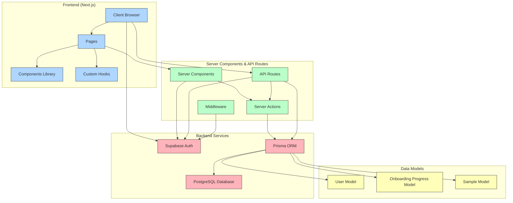
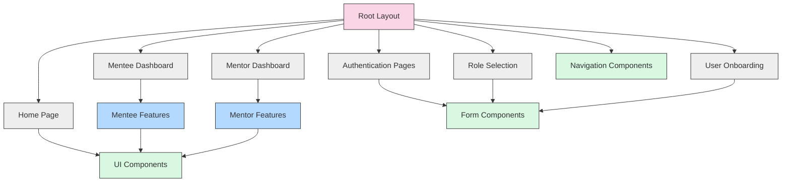
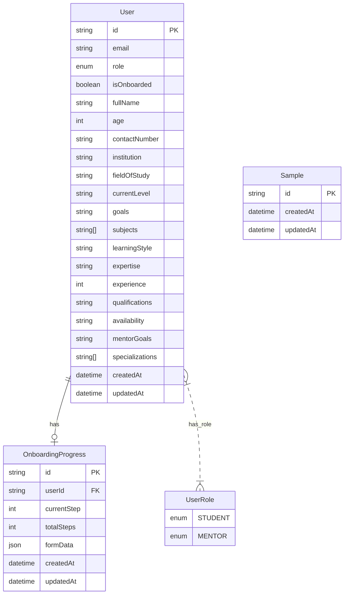
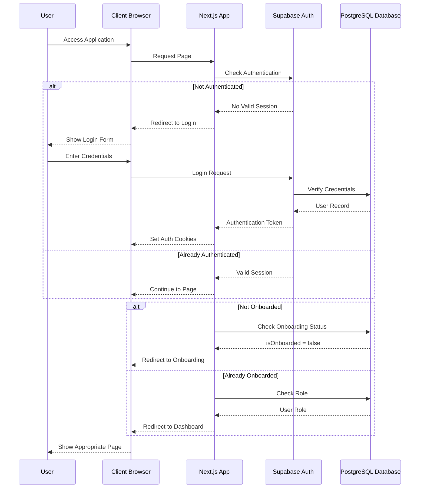
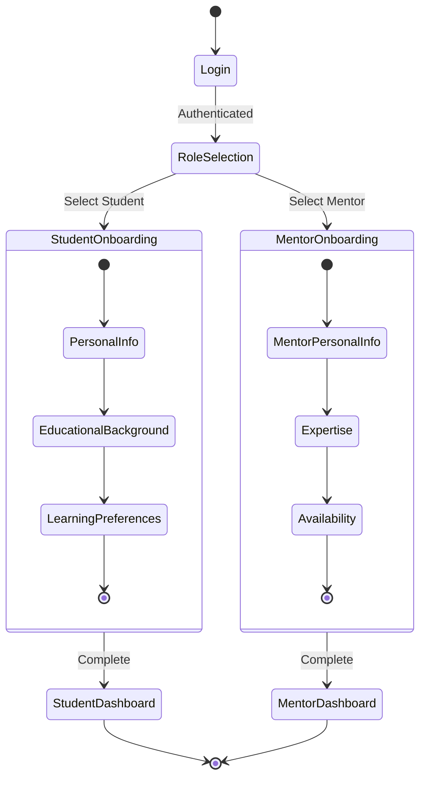
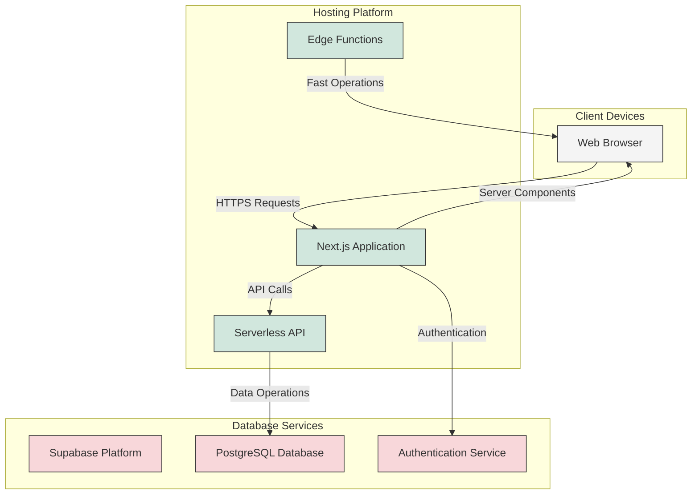

# Architecture Diagram

## Frontend-Backend Architecture

```mermaid
graph TD
    %% Client/Frontend Layer
    subgraph "Frontend (Next.js)"
        Client[Client Browser]
        Pages[Pages]
        Components[Components Library]
        Hooks[Custom Hooks]
    end

    %% Next.js Server Components & API Routes
    subgraph "Server Components & API Routes"
        ServerComponents[Server Components]
        APIRoutes[API Routes]
        ServerActions[Server Actions]
        Middleware[Middleware]
    end

    %% Backend Services
    subgraph "Backend Services"
        AuthService[Supabase Auth]
        PrismaORM[Prisma ORM]
        DatabaseService[PostgreSQL Database]
    end

    %% Data Models
    subgraph "Data Models"
        UserModel[User Model]
        OnboardingModel[Onboarding Progress Model]
        SampleModel[Sample Model]
    end

    %% Client Flow
    Client --> Pages
    Pages --> Components
    Pages --> Hooks
    
    %% Server Component Flow
    Pages --> ServerComponents
    ServerComponents --> ServerActions
    
    %% API Flow
    Client --> APIRoutes
    APIRoutes --> ServerActions
    
    %% Auth Flow
    Client --> AuthService
    ServerComponents --> AuthService
    APIRoutes --> AuthService
    Middleware --> AuthService
    
    %% Data Flow
    ServerActions --> PrismaORM
    APIRoutes --> PrismaORM
    PrismaORM --> UserModel
    PrismaORM --> OnboardingModel
    PrismaORM --> SampleModel
    PrismaORM --> DatabaseService

    %% Styling
    classDef frontend fill:#afd6ff,stroke:#333,stroke-width:1px;
    classDef server fill:#baffc9,stroke:#333,stroke-width:1px;
    classDef backend fill:#ffb3ba,stroke:#333,stroke-width:1px;
    classDef data fill:#ffffba,stroke:#333,stroke-width:1px;
    
    class Client,Pages,Components,Hooks frontend;
    class ServerComponents,APIRoutes,ServerActions,Middleware server;
    class AuthService,PrismaORM,DatabaseService backend;
    class UserModel,OnboardingModel,SampleModel data;
```

## Component Architecture

```mermaid
flowchart TD
    %% Root Layout
    RootLayout[Root Layout]
    
    %% Main Pages
    HomePage[Home Page]
    AuthPages[Authentication Pages]
    RoleSelection[Role Selection]
    OnboardingPages[User Onboarding]
    
    %% Dashboard Pages
    MenteeDashboard[Mentee Dashboard]
    MentorDashboard[Mentor Dashboard]
    
    %% Features
    MenteeFeatures[Mentee Features]
    MentorFeatures[Mentor Features]
    
    %% Components
    UIComponents[UI Components]
    FormComponents[Form Components]
    NavigationComponents[Navigation Components]
    
    %% Flow
    RootLayout --> HomePage
    RootLayout --> AuthPages
    RootLayout --> RoleSelection
    RootLayout --> OnboardingPages
    RootLayout --> MenteeDashboard
    RootLayout --> MentorDashboard
    
    MenteeDashboard --> MenteeFeatures
    MentorDashboard --> MentorFeatures
    
    HomePage --> UIComponents
    AuthPages --> FormComponents
    RoleSelection --> FormComponents
    OnboardingPages --> FormComponents
    MenteeFeatures --> UIComponents
    MentorFeatures --> UIComponents
    
    %% Navigation
    RootLayout --> NavigationComponents
    
    %% Styling
    classDef layout fill:#f9d5e5,stroke:#333,stroke-width:1px;
    classDef pages fill:#eeeeee,stroke:#333,stroke-width:1px;
    classDef features fill:#b3d9ff,stroke:#333,stroke-width:1px;
    classDef components fill:#d8f8e1,stroke:#333,stroke-width:1px;
    
    class RootLayout layout;
    class HomePage,AuthPages,RoleSelection,OnboardingPages,MenteeDashboard,MentorDashboard pages;
    class MenteeFeatures,MentorFeatures features;
    class UIComponents,FormComponents,NavigationComponents components;
```

## Database Schema

```mermaid
erDiagram
    User {
        string id PK
        string email
        enum role
        boolean isOnboarded
        string fullName
        int age
        string contactNumber
        string institution
        string fieldOfStudy
        string currentLevel
        string goals
        string[] subjects
        string learningStyle
        string expertise
        int experience
        string qualifications
        string availability
        string mentorGoals
        string[] specializations
        datetime createdAt
        datetime updatedAt
    }
    
    OnboardingProgress {
        string id PK
        string userId FK
        int currentStep
        int totalSteps
        json formData
        datetime createdAt
        datetime updatedAt
    }
    
    Sample {
        string id PK
        datetime createdAt
        datetime updatedAt
    }
    
    UserRole {
        enum STUDENT
        enum MENTOR
    }
    
    User ||--o| OnboardingProgress : has
    User }|..|{ UserRole : has_role
```

## Authentication Flow

```mermaid
sequenceDiagram
    participant User
    participant Client as Client Browser
    participant NextAuth as Next.js App
    participant Auth as Supabase Auth
    participant Database as PostgreSQL Database

    User->>Client: Access Application
    Client->>NextAuth: Request Page
    NextAuth->>Auth: Check Authentication
    
    alt Not Authenticated
        Auth-->>NextAuth: No Valid Session
        NextAuth-->>Client: Redirect to Login
        Client-->>User: Show Login Form
        User->>Client: Enter Credentials
        Client->>Auth: Login Request
        Auth->>Database: Verify Credentials
        Database-->>Auth: User Record
        Auth-->>NextAuth: Authentication Token
        NextAuth-->>Client: Set Auth Cookies
    else Already Authenticated
        Auth-->>NextAuth: Valid Session
        NextAuth-->>Client: Continue to Page
    end
    
    alt Not Onboarded
        NextAuth->>Database: Check Onboarding Status
        Database-->>NextAuth: isOnboarded = false
        NextAuth-->>Client: Redirect to Onboarding
    else Already Onboarded
        NextAuth->>Database: Check Role
        Database-->>NextAuth: User Role
        NextAuth-->>Client: Redirect to Dashboard
    end
    
    Client-->>User: Show Appropriate Page
```

## Onboarding Flow

```mermaid
stateDiagram-v2
    [*] --> Login
    Login --> RoleSelection: Authenticated
    
    RoleSelection --> StudentOnboarding: Select Student
    RoleSelection --> MentorOnboarding: Select Mentor
    
    state StudentOnboarding {
        [*] --> PersonalInfo
        PersonalInfo --> EducationalBackground
        EducationalBackground --> LearningPreferences
        LearningPreferences --> [*]
    }
    
    state MentorOnboarding {
        [*] --> MentorPersonalInfo
        MentorPersonalInfo --> Expertise
        Expertise --> Availability
        Availability --> [*]
    }
    
    StudentOnboarding --> StudentDashboard: Complete
    MentorOnboarding --> MentorDashboard: Complete
    
    StudentDashboard --> [*]
    MentorDashboard --> [*]
```

## Deployment Architecture

```mermaid
flowchart TD
    subgraph Client[Client Devices]
        Browser[Web Browser]
    end
    
    subgraph Hosting[Hosting Platform]
        NextApp[Next.js Application]
        EdgeFunctions[Edge Functions]
        ServerlessAPI[Serverless API]
    end
    
    subgraph Database[Database Services]
        Supabase[Supabase Platform]
        PostgreSQL[PostgreSQL Database]
        AuthService[Authentication Service]
    end
    
    Browser -->|HTTPS Requests| NextApp
    NextApp -->|Server Components| Browser
    NextApp -->|API Calls| ServerlessAPI
    NextApp -->|Authentication| AuthService
    ServerlessAPI -->|Data Operations| PostgreSQL
    EdgeFunctions -->|Fast Operations| Browser
    
    classDef client fill:#f4f4f4,stroke:#333,stroke-width:1px;
    classDef hosting fill:#d1e7dd,stroke:#333,stroke-width:1px;
    classDef database fill:#f8d7da,stroke:#333,stroke-width:1px;
    
    class Browser client;
    class NextApp,EdgeFunctions,ServerlessAPI hosting;
    class Supabase,PostgreSQL,AuthService database;
```
