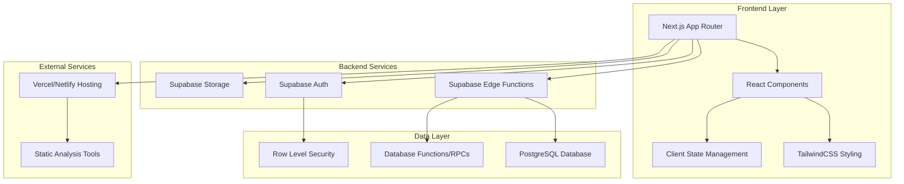

# Design Document

## Overview

The mentorship platform is a comprehensive web application built with Next.js and Supabase that connects students with mentors through a structured onboarding process, intelligent matching, and session booking system. The platform serves two primary user personas: students seeking academic guidance and mentors offering expertise.

The system emphasizes user experience through responsive design, persistent state management, and real-time data synchronization. Security is implemented through Supabase Row Level Security (RLS) policies, ensuring users can only access their own data and appropriate mentor information.

## Architecture

### High-Level Architecture



### Technology Stack

- **Frontend**: Next.js 14+ with App Router, React 18+, TypeScript
- **Styling**: TailwindCSS for responsive design
- **Backend**: Supabase (PostgreSQL, Auth, Storage, Edge Functions)
- **State Management**: Zustand with persist middleware for complex forms
- **Hosting**: Vercel/Netlify with environment variable configuration
- **Code Quality**: SonarCloud, CodeQL for static analysis

## Components and Interfaces

### Core Components

#### 1. Homepage Components
- **HeroSection**: Main value proposition and call-to-action
- **MentorCarousel**: Interactive carousel showcasing featured mentors
- **SessionHighlights**: Success stories and platform statistics
- **ResponsiveLayout**: Mobile-first responsive container

#### 2. Onboarding Components
- **MultiStepForm**: Generic multi-step form wrapper with progress tracking
- **StudentOnboardingForm**: Three-part student registration form
- **MentorOnboardingForm**: Professional mentor registration form
- **FormPersistence**: Local storage integration for form state

#### 3. Dashboard Components
- **StudentDashboard**: Mentor discovery and session management
- **MentorDashboard**: Analytics and session overview
- **AnalyticsCharts**: Recharts integration for data visualization
- **SessionBookingModal**: Two-modal booking flow with file upload

#### 4. Matching and Discovery
- **MentorGrid**: Responsive mentor listing with filtering
- **MatchingAlgorithm**: Server-side mentor ranking system
- **SearchFilters**: Subject, experience, and availability filters

### Interface Definitions

```typescript
// Core User Types
interface BaseUser {
  id: string;
  email: string;
  created_at: string;
  updated_at: string;
}

interface StudentProfile extends BaseUser {
  name: string;
  age: number;
  location: string;
  education_level: string;
  institution: string;
  major: string;
  academic_goals: string[];
  subject_interests: string[];
  proficiency_levels: Record<string, 'beginner' | 'intermediate' | 'advanced'>;
  learning_objectives: string;
  contact_preferences: string[];
}

interface MentorProfile extends BaseUser {
  name: string;
  current_position: string;
  institution_company: string;
  years_experience: number;
  expertise_areas: string[];
  preferred_subjects: string[];
  student_levels: string[];
  session_formats: string[];
  availability: string[];
  session_rate: number;
  bio: string;
  credentials: string[];
}

// Session Management
interface Session {
  id: string;
  student_id: string;
  mentor_id: string;
  scheduled_date: string;
  duration_minutes: number;
  status: 'pending_payment' | 'confirmed' | 'completed' | 'cancelled';
  payment_slip_url?: string;
  session_notes?: string;
  created_at: string;
}

// Matching System
interface MatchingCriteria {
  subject_alignment: number;
  level_compatibility: number;
  availability_overlap: number;
  overall_score: number;
}

interface MentorMatch {
  mentor: MentorProfile;
  matching_score: MatchingCriteria;
  rank: number;
}
```

## Data Models

### Database Schema

```sql
-- Enable Row Level Security
ALTER DATABASE postgres SET "app.jwt_secret" TO 'your-jwt-secret';

-- Profiles table for both students and mentors
CREATE TABLE profiles (
  id UUID PRIMARY KEY DEFAULT gen_random_uuid(),
  user_id UUID REFERENCES auth.users(id) ON DELETE CASCADE,
  user_type TEXT NOT NULL CHECK (user_type IN ('student', 'mentor')),
  name TEXT NOT NULL,
  email TEXT NOT NULL,
  profile_data JSONB NOT NULL DEFAULT '{}',
  created_at TIMESTAMP WITH TIME ZONE DEFAULT NOW(),
  updated_at TIMESTAMP WITH TIME ZONE DEFAULT NOW()
);

-- Sessions table
CREATE TABLE sessions (
  id UUID PRIMARY KEY DEFAULT gen_random_uuid(),
  student_id UUID REFERENCES profiles(id) ON DELETE CASCADE,
  mentor_id UUID REFERENCES profiles(id) ON DELETE CASCADE,
  scheduled_date TIMESTAMP WITH TIME ZONE NOT NULL,
  duration_minutes INTEGER NOT NULL DEFAULT 60,
  status TEXT NOT NULL DEFAULT 'pending_payment' 
    CHECK (status IN ('pending_payment', 'confirmed', 'completed', 'cancelled')),
  payment_slip_url TEXT,
  session_notes TEXT,
  created_at TIMESTAMP WITH TIME ZONE DEFAULT NOW(),
  updated_at TIMESTAMP WITH TIME ZONE DEFAULT NOW()
);

-- Indexes for performance
CREATE INDEX idx_profiles_user_id ON profiles(user_id);
CREATE INDEX idx_profiles_user_type ON profiles(user_type);
CREATE INDEX idx_sessions_student_id ON sessions(student_id);
CREATE INDEX idx_sessions_mentor_id ON sessions(mentor_id);
CREATE INDEX idx_sessions_status ON sessions(status);
```

### Row Level Security Policies

```sql
-- Enable RLS on all tables
ALTER TABLE profiles ENABLE ROW LEVEL SECURITY;
ALTER TABLE sessions ENABLE ROW LEVEL SECURITY;

-- Profiles policies
CREATE POLICY "Users can view their own profile" ON profiles
  FOR SELECT USING (auth.uid() = user_id);

CREATE POLICY "Users can insert their own profile" ON profiles
  FOR INSERT WITH CHECK (auth.uid() = user_id);

CREATE POLICY "Users can update their own profile" ON profiles
  FOR UPDATE USING (auth.uid() = user_id);

CREATE POLICY "Students can view mentor profiles" ON profiles
  FOR SELECT USING (
    user_type = 'mentor' OR 
    (auth.uid() = user_id)
  );

-- Sessions policies
CREATE POLICY "Users can view their own sessions" ON sessions
  FOR SELECT USING (
    auth.uid() IN (
      SELECT user_id FROM profiles WHERE id IN (student_id, mentor_id)
    )
  );

CREATE POLICY "Students can create sessions" ON sessions
  FOR INSERT WITH CHECK (
    auth.uid() = (SELECT user_id FROM profiles WHERE id = student_id)
  );

CREATE POLICY "Users can update their own sessions" ON sessions
  FOR UPDATE USING (
    auth.uid() IN (
      SELECT user_id FROM profiles WHERE id IN (student_id, mentor_id)
    )
  );
```

### Database Functions

```sql
-- Mentor matching algorithm
CREATE OR REPLACE FUNCTION match_mentors_for_student(student_uuid UUID)
RETURNS TABLE (
  mentor_id UUID,
  mentor_data JSONB,
  matching_score NUMERIC
) AS $$
BEGIN
  RETURN QUERY
  SELECT 
    p.id,
    p.profile_data,
    calculate_matching_score(student_uuid, p.id) as score
  FROM profiles p
  WHERE p.user_type = 'mentor'
  ORDER BY score DESC
  LIMIT 20;
END;
$$ LANGUAGE plpgsql SECURITY DEFINER;

-- Analytics for mentor dashboard
CREATE OR REPLACE FUNCTION get_mentor_analytics(mentor_uuid UUID)
RETURNS JSONB AS $$
DECLARE
  result JSONB;
BEGIN
  SELECT jsonb_build_object(
    'age_groups', (
      SELECT jsonb_object_agg(age_group, count)
      FROM (
        SELECT 
          CASE 
            WHEN (p.profile_data->>'age')::int < 20 THEN 'Under 20'
            WHEN (p.profile_data->>'age')::int < 25 THEN '20-24'
            WHEN (p.profile_data->>'age')::int < 30 THEN '25-29'
            ELSE '30+'
          END as age_group,
          COUNT(*) as count
        FROM sessions s
        JOIN profiles p ON s.student_id = p.id
        WHERE s.mentor_id = mentor_uuid
        GROUP BY age_group
      ) age_stats
    ),
    'subject_interests', (
      SELECT jsonb_object_agg(subject, count)
      FROM (
        SELECT 
          jsonb_array_elements_text(p.profile_data->'subject_interests') as subject,
          COUNT(*) as count
        FROM sessions s
        JOIN profiles p ON s.student_id = p.id
        WHERE s.mentor_id = mentor_uuid
        GROUP BY subject
      ) subject_stats
    )
  ) INTO result;
  
  RETURN result;
END;
$$ LANGUAGE plpgsql SECURITY DEFINER;
```

## Error Handling

### Client-Side Error Handling

```typescript
// Error boundary for React components
class ErrorBoundary extends React.Component {
  constructor(props) {
    super(props);
    this.state = { hasError: false, error: null };
  }

  static getDerivedStateFromError(error) {
    return { hasError: true, error };
  }

  componentDidCatch(error, errorInfo) {
    console.error('Error caught by boundary:', error, errorInfo);
    // Log to external service in production
  }

  render() {
    if (this.state.hasError) {
      return <ErrorFallback error={this.state.error} />;
    }
    return this.props.children;
  }
}

// API error handling utility
export const handleApiError = (error: any) => {
  if (error.code === 'PGRST301') {
    return 'Authentication required. Please log in.';
  }
  if (error.code === 'PGRST116') {
    return 'Access denied. You don\'t have permission for this action.';
  }
  if (error.message?.includes('duplicate key')) {
    return 'This record already exists.';
  }
  return error.message || 'An unexpected error occurred.';
};
```

### Server-Side Error Handling

```sql
-- Database function error handling
CREATE OR REPLACE FUNCTION safe_create_session(
  p_student_id UUID,
  p_mentor_id UUID,
  p_scheduled_date TIMESTAMP WITH TIME ZONE
) RETURNS JSONB AS $$
DECLARE
  result JSONB;
  session_id UUID;
BEGIN
  -- Validate inputs
  IF p_student_id IS NULL OR p_mentor_id IS NULL THEN
    RETURN jsonb_build_object('error', 'Missing required parameters');
  END IF;
  
  -- Check if mentor exists and is available
  IF NOT EXISTS (
    SELECT 1 FROM profiles 
    WHERE id = p_mentor_id AND user_type = 'mentor'
  ) THEN
    RETURN jsonb_build_object('error', 'Mentor not found');
  END IF;
  
  -- Create session
  INSERT INTO sessions (student_id, mentor_id, scheduled_date)
  VALUES (p_student_id, p_mentor_id, p_scheduled_date)
  RETURNING id INTO session_id;
  
  RETURN jsonb_build_object('success', true, 'session_id', session_id);
  
EXCEPTION
  WHEN OTHERS THEN
    RETURN jsonb_build_object('error', SQLERRM);
END;
$$ LANGUAGE plpgsql SECURITY DEFINER;
```

## Testing Strategy

### Unit Testing
- **Component Testing**: React Testing Library for UI components
- **Hook Testing**: Custom hooks with @testing-library/react-hooks
- **Utility Testing**: Jest for pure functions and utilities
- **Database Testing**: pgTAP for database functions and policies

### Integration Testing
- **API Testing**: Supertest for Edge Function endpoints
- **Database Integration**: Test database with realistic data
- **Authentication Flow**: End-to-end auth testing with test users

### End-to-End Testing
- **User Journey Testing**: Playwright for complete user flows
- **Cross-Browser Testing**: Chrome, Firefox, Safari compatibility
- **Mobile Testing**: Responsive design validation
- **Performance Testing**: Lighthouse CI for performance metrics

### Test Data Management
```sql
-- Test data seeding function
CREATE OR REPLACE FUNCTION seed_test_data() RETURNS VOID AS $$
BEGIN
  -- Create test mentors
  INSERT INTO profiles (user_id, user_type, name, email, profile_data)
  SELECT 
    gen_random_uuid(),
    'mentor',
    'Dr. ' || (ARRAY['Smith', 'Johnson', 'Williams', 'Brown'])[floor(random() * 4 + 1)],
    'mentor' || generate_series || '@test.com',
    jsonb_build_object(
      'expertise_areas', ARRAY['Mathematics', 'Physics', 'Computer Science'],
      'years_experience', floor(random() * 20 + 5),
      'session_rate', floor(random() * 100 + 50)
    )
  FROM generate_series(1, 12);
  
  -- Create test students
  INSERT INTO profiles (user_id, user_type, name, email, profile_data)
  SELECT 
    gen_random_uuid(),
    'student',
    'Student ' || generate_series,
    'student' || generate_series || '@test.com',
    jsonb_build_object(
      'age', floor(random() * 10 + 18),
      'education_level', 'undergraduate',
      'subject_interests', ARRAY['Mathematics', 'Physics']
    )
  FROM generate_series(1, 20);
END;
$$ LANGUAGE plpgsql;
```

### Performance Testing
- **Load Testing**: Artillery.js for API endpoint load testing
- **Database Performance**: Query execution time monitoring
- **Frontend Performance**: Bundle size analysis and Core Web Vitals
- **Memory Usage**: React DevTools Profiler for component performance

The testing strategy ensures comprehensive coverage across all layers of the application, from individual components to complete user journeys, while maintaining realistic test data and performance benchmarks.